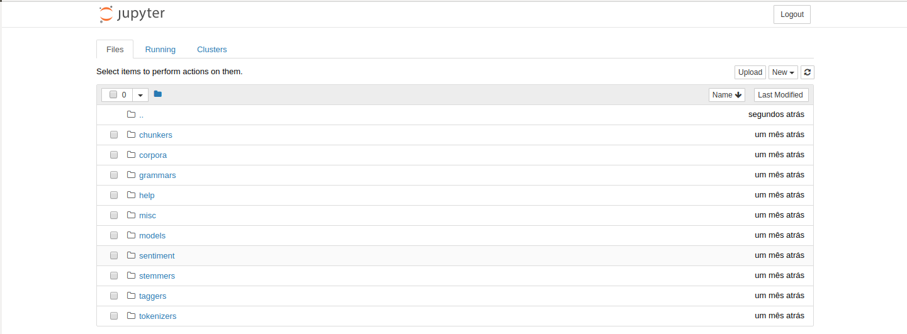

```{r setup, include=FALSE}
knitr::opts_chunk$set(echo = TRUE)
```

# Jupyter

Continuando o tema abordado pelo Professor Fernando Mayer no ultimo
[post](http://blog.leg.ufpr.br/archives/363). Hoje aboraremos o uso
do Jupyter, mais expecificamente a junção do Jupyter Notebook com o
Emacs.

## Mas afinal, o que é um Jupyter Notebook?

Muitos alunos do curso de Estatística estão familiarizado com a
utilização do RMarkdown para a elaboração de trabalhos acadêmicos e
de forma bem simplificada o Jupyter Notebook faz o mesmo trabalho,
integrando código e texto, assim facilitando na escrita de textos
científicos, pesquisas reproduzíveis e etc.
O Jupyter é uma ferramenta muito poderosa, pois nos permite criar
documentos utilizando varias linguagens, como R, Julia e Python.

## Instalando o Jupyter

Para instalar o Jupyter, basta rodar o código abaixo (aqui
utilizando o pip como instalador).

``` {sh, eval=FALSE}
sudo pip3 install -U jupyter
```

Para abrir um Jupyter Notebook basta rodar o seguinte codigo no
terminal. 

``` {sh, eval=FALSE}
jupyter notebook
```
Apos a execução, o seu navegador padrão abrira na seguinte tela:



Para maiores informações de como usar o Jupyter veja esse
[link](http://jupyter.org/documentation).

## Instalando o EIN -- Emacs IPython Notebook

Para utilizar o Jupyter Notebook no Emacs utilizaremos o pacote 
[ein](https://tkf.github.io/emacs-ipython-notebook/).

A principal motivação para rodar o Jupyter no emacs é a utilização de
atalhos e ferramentas do proprio Emacs. Eu por exemplo costumo utilizar
muito o pacote [multiple-cursors](https://github.com/magnars/multiple-cursors.el),
que permite a edição de varias linhas do nosso codigo ao mesmo tempo.

A instalação do Ein deve ser feita através do MELPA (que é o
procedimento padrão para se instalar qualquer pacote no Emacs). Para
habilitar o MELPA (se ainda não estiver habilitado) veja esse
[link](https://www.emacswiki.org/emacs/MELPA). Feito isso, digite:

```
M-x package-list-packages
```

para abrir a lista de pacotes disponíveis do MELPA. Procure pelo Ein
com

```
C-s Ein
```

e aperte <kbd>Enter</kbd> para instalar automaticamente. Feito isso,
abra seu `~/.emacs` e insira essas linhas para habilitar o pacote:

```
(package-initialize)
(require 'ein)
(require 'ein-loaddefs)
(require 'ein-notebook)
(require 'ein-subpackages)
```

Após inserir salve com <kbd>C-x C-s</kbd> e reinicie o Emacs.