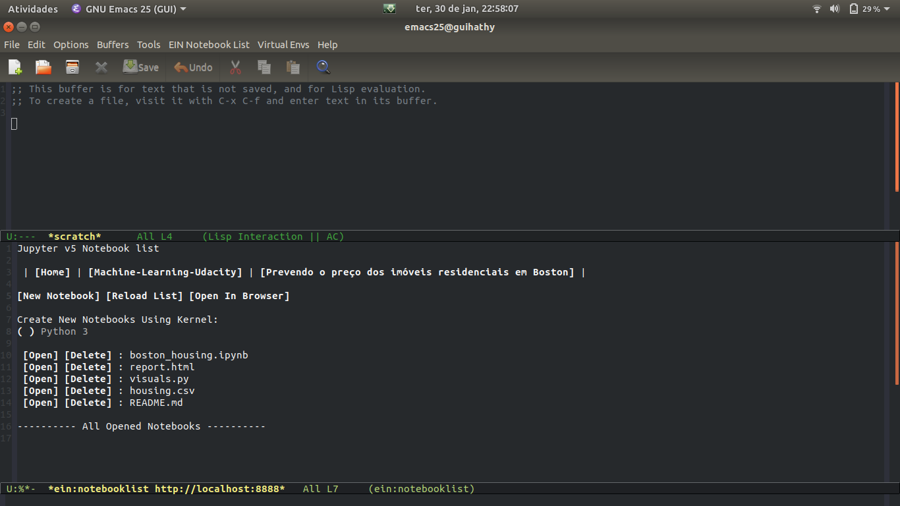

```{r setup, include=FALSE}
knitr::opts_chunk$set(echo = TRUE)
```

# Jupyter

Continuando o tema abordado pelo Professor Fernando Mayer no ultimo
[post](http://blog.leg.ufpr.br/archives/363). Hoje aboraremos o uso
do Jupyter, mais especificamente a junção do Jupyter Notebook com o
Emacs.

## Mas afinal, o que é um Jupyter Notebook?

Muitos alunos do curso de Estatística estão familiarizado com a
utilização do RMarkdown para a elaboração de trabalhos acadêmicos e
de forma bem simplificada o Jupyter Notebook faz o mesmo trabalho,
integrando código e texto, assim facilitando a escrita de textos
científicos, pesquisas reproduzíveis e etc.
O Jupyter é uma ferramenta muito poderosa, pois nos permite criar
documentos utilizando varias linguagens, como R, Julia e Python.

### Instalando o Jupyter

Podemos instalar o Jupyter utilizando o próprio `pip`, 
basta rodar o código abaixo.

``` {sh, eval=FALSE}
sudo pip3 install -U jupyter
```

Para abrir um Jupyter Notebook basta rodar o seguinte código no
terminal. 

``` {sh, eval=FALSE}
jupyter notebook
```
Após a execução, o seu navegador padrão abrirá na seguinte tela:


Para maiores informações de como usar o Jupyter veja esse
[link](http://jupyter.org/documentation).

## Instalando o EIN -- Emacs IPython Notebook

Para utilizar o Jupyter Notebook no Emacs utilizaremos o pacote 
[Ein](https://tkf.github.io/emacs-ipython-notebook/).

A principal motivação para rodar o Jupyter no emacs é a utilização de
atalhos e ferramentas do proprio Emacs. Eu por exemplo costumo utilizar
muito o pacote [multiple-cursors](https://github.com/magnars/multiple-cursors.el),
que permite a edição de varias linhas do nosso código ao mesmo tempo.

A instalação do Ein deve ser feita através do MELPA (que é o
procedimento padrão para se instalar qualquer pacote no Emacs). Para
habilitar o MELPA (se ainda não estiver habilitado) veja esse
[link](https://www.emacswiki.org/emacs/MELPA). Feito isso, digite:

```
M-x package-list-packages
```

para abrir a lista de pacotes disponíveis do MELPA. Procure pelo Ein
com

```
C-s Ein
```

e aperte <kbd>Enter</kbd> para instalar automaticamente. Feito isso,
abra seu `~/.emacs` e insira essas linhas para habilitar o pacote:

```
(package-initialize)
(require 'ein)
(require 'ein-loaddefs)
(require 'ein-notebook)
(require 'ein-subpackages)
```

Após inserir salve com <kbd>C-x C-s</kbd> e reinicie o Emacs.

### Iniciando um Notebook no Emacs

Após a instalação do pacote Ein, podemos começar à utilizar o Jupyter
Notebook integrado com o Emacs.

Para começar devemos iniciar um servidor do Jupyter no nosso computador.
Para isso abrimos o nosso Emacs e utilizaremos o comando `M-x ein:jupyter-server-start`,
em seguida devemos colocar o local no qual esta instalado o Jupyter `Server Command:
/usr/local/bin/jupyter` (Pasta padrão no Ubuntu) e por ultimo colocaremos
o caminho para a pasta que queremos iniciar o Jupyter Notebook.

Se tudo ocorrer sem erro, o Emacs abrirá uma janela para a administração dos notebooks.


<br/><br/>
Para criar um novo Notebook basta clicar em `New Notebook`, um arquivo com o nome `Untitled.ipynb`
será criado na pasta que o Jupyter esta sendo executado.

Para renomear o Notebook basta usar o comando

```
C-x C-w
```

## Principais Atalhos

Separei alguns dos principais atalhos para a utilização do pacote Ein,
a lista completa pode ser acessada no [link](https://tkf.github.io/emacs
-ipython-notebook/#commands-keybinds).

- `C-c C-c` para executar a cell e permanecer nela.

- `M-RET` executa a cell e vai para a próxima, caso não tenha, ele cria uma.

- `C-c C-a` para inserir uma cell antes da cell na qual estamos.

- `M-up` ou `M-down` para trocar a cell de posição.

- Após criar uma nova cell, `C-c C-u m` faz ela virar uma markdown cell.